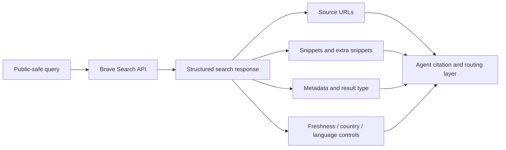

# Brave Search API Research

## Question

Is Brave Search API a strong hosted search backend for coding agents, and what are its trust, quota, cost, and result-shape tradeoffs?

## Method

Observed at: 2026-05-23.

This report reviewed official Brave Search API product pages, API documentation, public examples, and Brave's Search API Data Processing Addendum. It does not include live authenticated API samples because testing requires a subscription token. The report therefore separates documented behavior from untested runtime behavior.

Public-safe query set for future live testing:

- `SearXNG Search API official documentation`
- `Python 3.14 release notes`
- `OpenTelemetry semantic conventions`
- `Model Context Protocol specification`
- `site:github.com brave search api mcp`

Agent ecosystems in scope:

- Codex
- Claude Code
- OpenClaw
- generic MCP-capable agents

Not tested:

- authenticated API latency
- live relevance on the public query set
- account-specific quota behavior
- billing dashboard behavior
- third-party MCP adapters
- region-specific availability

## Inputs

Only public documentation and public-safe query examples are used. No API keys, account identifiers, dashboard screenshots, private prompts, private endpoints, private source excerpts, cookies, tokens, or customer data are included.

## Official Sources

- [Brave Search API product page](https://brave.com/search/api/) observed at 2026-05-23.
- [Brave Web Search API documentation](https://api-dashboard.search.brave.com/app/documentation/web-search) observed at 2026-05-23.
- [Brave Search API Data Processing Addendum](https://cdn.search.brave.com/search-api/web/v1/client/_app/immutable/assets/brave-search-api-dpa-latest.DRXCoye6.pdf) dated 2025-09-09, observed at 2026-05-23.
- [Brave Search API Zero Data Retention announcement](https://brave.com/blog/search-api-zero-data-retention/) published 2026-01-26, observed at 2026-05-23.

## Findings

### Official claims

Brave positions Search API as a hosted search API built on Brave's independent Web index. The product page presents it for agentic search, RAG, AI search, AI training, and search-enabled tools. It also states that the API can return complete search results such as URLs, text, news, images, and additional LLM context.

As of 2026-05-23, the public product page lists:

- Search: `$5 per 1,000 requests`, includes `$5` free credits each month, capacity `50 queries per second`
- Answers: `$4 per 1,000 requests` plus `$5 per million input/output tokens`, includes `$5` free credits each month, capacity `2 queries per second`
- Enterprise: custom terms, capacity, endpoints, custom agreements, support, and full-funnel Zero Data Retention

These are volatile commercial terms and must be rechecked before any recommendation that depends on cost or quota.

### Documented API shape

The Web Search endpoint uses:

- base route: `https://api.search.brave.com/res/v1/web/search`
- authentication header: `X-Subscription-Token`
- JSON responses
- query parameter `q`
- result controls such as `count`, `offset`, `country`, `search_lang`, `ui_lang`, `safesearch`, and `freshness`

The documentation also describes:

- freshness filters: last 24 hours, last 7 days, last 31 days, last year, and custom date ranges
- country and language targeting
- up to five extra snippets per result when `extra_snippets=true`
- Goggles for custom reranking and filtering
- search operators inside the `q` parameter, such as exact phrases, exclusions, site-specific queries, and file type queries
- pagination with a documented `more_results_available` check
- local enrichments using temporary location IDs
- rich data enrichments for verticals such as weather, stocks, currency, crypto, sports, and definitions

The product page and examples also show non-web endpoints or surfaces for images, videos, news, suggestions, spellcheck, and Answers. These are useful for products, but coding agents should usually start with Web Search unless a task explicitly needs a specialized vertical.

### Privacy and retention evidence

Brave markets the Search API as privacy-oriented and advertises Zero Data Retention for enterprise usage. The Search API Data Processing Addendum observed on 2026-05-23 lists AWS as an infrastructure provider and states `90 days` for search query logs, while also listing an option for Zero Data Retention for Enterprise clients, subject to legal obligations.

For agent builders, the practical conclusion is:

- Brave is a hosted provider, so queries leave the user's machine or organization.
- Operators should review the current DPA, privacy/security documentation, and plan terms before sending sensitive task context.
- Zero Data Retention should not be assumed for every plan unless the current contract or official plan terms explicitly grant it.

### Copyright and storage constraints

Brave states that Search API returns a ranked list of publicly available webpages and relevance-supporting information such as snippets. It also states that the API does not grant rights to third-party webpage content. Storage rights require a plan that explicitly grants storage rights.

For coding agents, this means Brave can supply source discovery and snippets, but agents should cite opened public URLs and should not treat returned snippets as reusable licensed content.

### Inference from the evidence

Brave Search API is a strong hosted option when:

- a team wants a managed Web search backend
- structured source URLs and snippets are needed
- freshness filters, language/country targeting, site operators, and reranking controls matter
- credential and billing management are acceptable
- the team prefers a hosted independent-index provider over operating SearXNG

It is weaker when:

- no external hosted provider may receive queries
- subscription tokens cannot be safely managed
- cost, quota, or plan terms are unacceptable
- the workflow needs fully operator-owned engine policy and logs
- storage rights or downstream content reuse are unclear
- live relevance and citation quality have not been benchmarked for the target task set

### Unknowns

- live relevance on coding-agent query sets
- latency distribution under real workloads
- exact behavior of all specialized endpoints for agent tasks
- current MCP adapter maturity
- plan-specific retention and storage-right details beyond published docs

## Limitations

This report is documentation-based. It does not claim live API result quality. A later benchmark should use a real subscription token in a private environment, record only public-safe aggregate observations, and avoid publishing credentials, account data, raw private logs, or dashboard screenshots.

## Visual Evidence

### Result-shape model

### Scorecard

| Dimension | Observation | Evidence |
| --- | --- | --- |
| Source URL quality | Strong documented fit | Web Search examples include URLs, descriptions, metadata, and query-dependent snippets. |
| Freshness controls | Strong documented fit | Official docs include freshness filters and recent-result controls. |
| Quota/cost | Clear but volatile | Product page lists request pricing, monthly credits, and qps limits as of 2026-05-23. |
| Privacy boundary | Hosted provider tradeoff | DPA describes processing, subprocessors, query-log retention, and Enterprise ZDR option. |
| Adapter readiness | Promising but unverified | API shape is straightforward for wrappers; third-party MCP adapters still require separate review. |
| Operator control | Weaker than self-hosted | Backend ranking, logs, retention, and crawler policy are provider-managed. |

### Route decision table

| Use Case | Fit | Reason |
| --- | --- | --- |
| Hosted web search backend | Good | Structured results, source URLs, snippets, freshness controls, and official API docs. |
| Coding-agent documentation lookup | Good candidate | Supports site operators, freshness filters, and source URLs; needs live benchmark. |
| Private-context search | Poor by default | Queries go to a hosted provider; rewrite into public-safe queries first. |
| Primary agent search for teams without ops capacity | Good candidate | Avoids operating SearXNG, but adds credential, cost, and provider-policy requirements. |
| Fully operator-controlled search | Weak | SearXNG or internal search is a better fit when logs and backend policy must be owned. |

## Matrix Impact

README option matrix update:

- Solution row: `Brave Search API`
- Best Practice cell: keep `Seeking`
- Research Report cell: link this report
- Strengths: emphasize hosted independent-index Web search, structured source URLs, freshness controls, country/language targeting, extra snippets, and Goggles
- Limitations: emphasize subscription token management, cost/quota volatility, hosted-provider privacy boundary, storage/copyright constraints, and missing live benchmark
- Agent Support Matrix: keep Codex, Claude Code, OpenClaw, and generic MCP-capable agents when wrapped through tool calls or adapters

## Recommendation

Use Brave Search API as a serious hosted search candidate for coding agents when teams want structured public Web results without operating their own search backend. It is especially relevant for tasks that need fresh public documentation, release notes, source URLs, snippets, and query controls.

Do not use it as a blind default for private task context. Keep agent queries public-safe, store the subscription token outside prompts and repository files, and benchmark relevance, citation quality, latency, cost, and retention terms before adopting it as a primary route.

## Privacy Notes

Agents should never include private source code, private issue text, customer data, private hostnames, local paths, cookies, tokens, or credentials in Brave queries. The API key should live in a secret store or local environment, not in examples, prompts, registry entries, screenshots, or committed config.

If a task includes private context, rewrite it into a narrow public query before calling a Brave-backed route. If the query cannot be made public-safe, use local repository search, private documentation search, or user confirmation instead.
