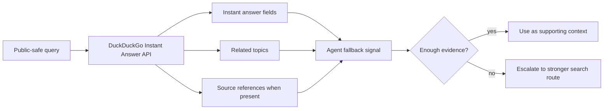

# DuckDuckGo Instant Answer API Research

## Question

Can DuckDuckGo Instant Answer API serve as a lightweight fallback signal for agents, and what makes it unsuitable as a full primary web-search backend?

## Method

Observed at: 2026-05-23.

This report reviewed public documentation and primary implementation notes. It did not include live endpoint samples in this revision, so behavioral claims are limited to documented capabilities and limitations.

Public-safe query set for future live testing:

- `SearXNG`
- `Python programming language`
- `Model Context Protocol`
- `DuckDuckGo Instant Answer API`
- `OpenTelemetry`

Agent ecosystems in scope:

- Codex
- Claude Code
- OpenClaw
- generic MCP-capable agents

Not tested:

- private account behavior
- undocumented rate limits
- latency, availability, or result quality under load
- region-specific availability
- production wrapper behavior

## Inputs

Only public sources and public-safe query examples are used. No private prompts, private source excerpts, local paths, account data, endpoint secrets, cookies, tokens, or private screenshots are included.

## Official And Primary Sources

- [DuckDuckGo Instant Answers help page](https://duckduckgo.com/duckduckgo-help-pages/features/instant-answers-and-other-features/) observed at 2026-05-23.
- [DuckDuckGo API entry point](https://duckduckgo.com/api) observed at 2026-05-23.
- [DuckDuckGo API endpoint](https://api.duckduckgo.com/api) observed at 2026-05-23.
- [SearXNG DuckDuckGo engine documentation](https://docs.searxng.org/dev/engines/online/duckduckgo.html) observed at 2026-05-23.
- [SearXNG `duckduckgo_definitions` source documentation](https://docs.searxng.org/_modules/searx/engines/duckduckgo_definitions.html) observed at 2026-05-23.

## Findings

### Official claims

DuckDuckGo describes Instant Answers as direct answer features for calculations, factual information, flight status, password generation, and other quick-answer tasks. That positions Instant Answers as a selective answer layer, not as a general web-search results API.

The public API entry points remain known, but the API documentation surface is limited. The DuckDuckGo API entry point is an official URL, while SearXNG's DuckDuckGo engine documentation states that the DuckDuckGo Instant Answer API is no longer documented and that current behavior is inferred from implementation work. Treat that as a maintenance and stability warning for agent builders.

### Observed from primary implementation notes

SearXNG documents a DuckDuckGo Instant Answer route using JSON output and marks the implementation as not requiring an API key. It also notes that language support is unclear and appears to be mostly based on English terms.

SearXNG also documents that malformed or broken answer text can appear and should be ignored in some cases. That matters for agents because a fallback signal must be validated before it influences an answer.

### Inference from the evidence

DuckDuckGo Instant Answer API can be useful as a narrow fallback for:

- entity lookup
- definition-style answers
- calculator or utility-style answers
- lightweight public facts
- routing hints before escalating to a stronger search backend

It should not be treated as a primary coding-agent search backend because:

- it is not documented as a full web search results API
- broad result ranking and deep source coverage are not its core shape
- official API documentation visibility is weak
- language and localization behavior are unclear
- freshness, quota, and stability guarantees are not documented enough for primary routing

### Unknowns

- current rate-limit policy
- production availability under agent traffic
- exact JSON schema stability
- documented language support
- freshness expectations for technical documentation and release notes

## Limitations

This report does not claim live endpoint performance or result quality. A later benchmark should run the public-safe query set above and record:

- response status
- returned top-level fields
- whether a source URL is present
- whether the answer is useful for a coding-agent task
- latency
- repeated-query stability

## Visual Evidence

### Result-shape model

### Route decision table

| Use Case | Fit | Reason |
| --- | --- | --- |
| Entity or definition lookup | Good fallback | Instant-answer style responses can be enough when source evidence is present. |
| Calculator or utility answer | Good fallback | DuckDuckGo documents utility-style Instant Answers. |
| Coding documentation search | Weak | Agents usually need ranked source URLs, current docs, examples, and release notes. |
| Primary web-search backend | Poor | The API is not documented as a full web search results API. |
| Hybrid search routing signal | Useful with guards | Can help decide whether a stronger route is needed, but should not be the only evidence. |

## Matrix Impact

README option matrix update:

- Solution row: `DuckDuckGo Instant Answer API`
- Best Practice cell: keep `Seeking`
- Research Report cell: link this report
- Strengths: emphasize no-key instant-answer JSON and lightweight fallback use
- Limitations: emphasize non-full-search scope, weak documentation visibility, unclear language/freshness/coverage behavior
- Agent Support Matrix: keep generic wrapper-capable agent support

## Recommendation

Use DuckDuckGo Instant Answer API only as a lightweight fallback or routing signal. It is appropriate when an agent needs a quick public fact, definition, or utility answer and can verify the returned source context.

Do not use it as the default primary search backend for coding-agent tasks. Prefer SearXNG, hosted search APIs, native provider search, or browser retrieval when the task requires broad source discovery, ranked URLs, fresh documentation, release notes, issue threads, or citation-quality evidence.

## Privacy Notes

Agents should send only narrow public-safe queries. Do not include private source code, local paths, private issue text, private hostnames, customer data, account identifiers, cookies, tokens, or credentials.

Because this route is best treated as a fallback, agents should avoid sending raw task context. Rewrite the need into a short public query such as an entity name, package name, public API name, or standards term.
