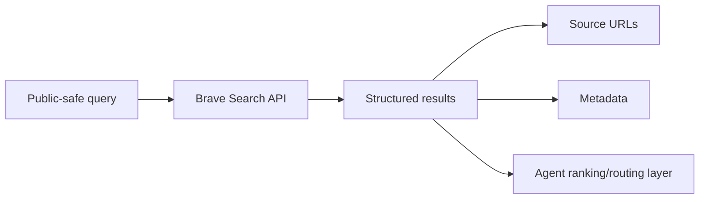

## Research Question

Is Brave Search API a strong hosted search backend for coding agents, and what are its trust, quota, cost, and result-shape tradeoffs?

## Matrix Row Or Gap

README row: [Brave Search API](https://brave.com/search/api/)

Current gap:

- `Best Practice`: `Seeking`
- `Research Report`: `Researching`

## Required Official Sources

- [Brave Search API](https://brave.com/search/api/)
- Brave Search API documentation linked from the official Brave API page

Record `observedAt` for endpoint categories, authentication, quota, pricing, retention, and usage constraints.

## Method

- Review official Brave Search API docs.
- Document API shape, authentication, result fields, source URLs, freshness controls, and endpoint categories.
- Define a small public-safe query set for coding-agent tasks.
- Compare Brave Search API with SearXNG as an operator-controlled baseline and Tavily as an agent-oriented hosted API.
- Evaluate wrapper and MCP suitability without endorsing unreviewed adapters.

Do not publish API keys, account data, dashboard screenshots, raw private query logs, or private endpoint details.

## Visual Evidence

Expected scorecard:

| Dimension | Observation | Evidence |
| --- | --- | --- |
| Source URL quality | TBD | Official docs and public query set |
| Freshness controls | TBD | Official docs |
| Quota/cost | TBD | Dated official pricing or quota docs |
| Privacy boundary | TBD | Official policy/docs |
| Adapter readiness | TBD | Public adapter evidence only |

Expected result-shape diagram:

## Findings To Produce

Cover:

- official claims
- observed public-query behavior
- credentials and secret-handling requirements
- quota/cost implications
- source quality and citation suitability
- MCP or wrapper integration implications

## Matrix Impact

Expected README update:

- replace `Researching` with a Brave-specific report link
- replace `Seeking` only when a durable best-practice entry exists
- update strengths and limitations using dated evidence

## Acceptance Criteria

- Pricing and quota statements are dated.
- Vendor claims and observed behavior are separated.
- No API key, account data, or dashboard screenshot is published.
- README matrix update is included.
- New durable docs are added to `registry/resources.json`.

## Privacy Notes

Use only public-safe query examples. Do not include credentials, headers, private source snippets, account identifiers, or provider dashboard data.
