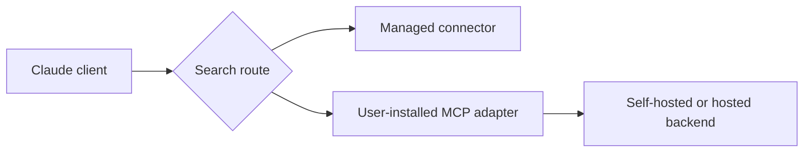

## Research Question

When should Claude users rely on Claude's managed MCP Web Search connector, and when should they use a self-managed MCP adapter or search backend?

## Matrix Row Or Gap

README row: [Claude MCP Web Search](https://support.claude.com/en/articles/14503775-mcp-web-search)

Current gap:

- `Best Practice`: `Seeking`
- `Research Report`: broad strategy comparison only, no Claude-managed search report

## Required Official Sources

- [Claude MCP Web Search](https://support.claude.com/en/articles/14503775-mcp-web-search)
- [Claude Code docs](https://code.claude.com/docs/)

Record `observedAt` for product availability, workspace behavior, account constraints, supported clients, and configuration boundaries.

## Method

- Review official Claude docs and identify what is product-managed versus user-managed.
- Compare managed Claude search with user-installed MCP search adapters.
- Document what the user can configure, inspect, disable, or verify.
- Record unknowns and unavailable details explicitly.

Do not include private workspace output, account details, local command transcripts, private endpoints, or screenshots containing identifiers.

## Visual Evidence

Expected public-safe visual:

| Route | Owner | User Controls | Main Risk |
| --- | --- | --- | --- |
| Claude managed web search | Provider/workspace | Product settings where available | Availability and backend policy are provider-managed. |
| Local MCP adapter | User/operator | Scope, endpoint, adapter, lifecycle | User must manage installation, endpoint health, and uninstall. |
| Self-hosted backend | User/team | Engine policy, logs, retention, routing | Requires operations and monitoring. |

Optional lifecycle diagram:

## Findings To Produce

Cover:

- availability by product or workspace
- install and verification expectations
- query visibility and citation behavior
- operator control versus convenience
- support for Claude Code and other Claude surfaces

## Matrix Impact

Expected README update:

- keep `Best Practice` as `Seeking` unless a stable official setup/best-practice page exists
- link the new Claude-specific research report
- refine strengths and limitations around availability and operator control

## Acceptance Criteria

- No private workspace behavior is pasted.
- Plan, workspace, or region details are dated and sourced if included.
- Claude Code support is stated only where official docs support it.
- README matrix update is included.
- New durable docs are added to `registry/resources.json`.

## Privacy Notes

Use sanitized, public descriptions only. Do not publish account names, workspace names, private screenshots, private prompts, cookies, tokens, or raw command output.
