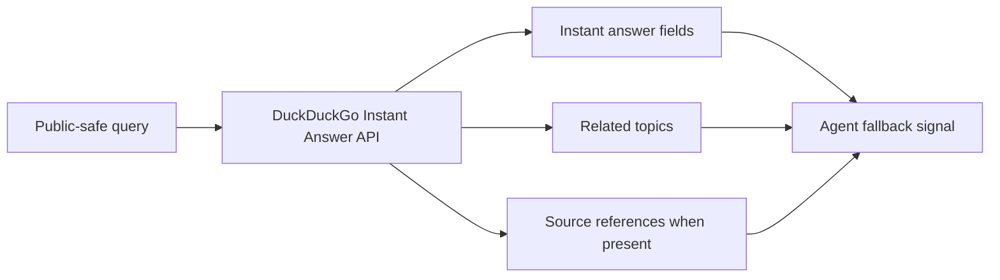

## Research Question

Can DuckDuckGo Instant Answer API serve as a lightweight fallback signal for agents, and what makes it unsuitable as a full primary web-search backend?

## Matrix Row Or Gap

README row: [DuckDuckGo Instant Answer API](https://duckduckgo.com/api)

Current gap:

- `Best Practice`: `Seeking`
- `Research Report`: `Researching`

## Required Official Sources

- [DuckDuckGo Instant Answer API](https://duckduckgo.com/api)
- [DuckDuckGo API endpoint documentation](https://api.duckduckgo.com/api)

Record `observedAt` for endpoint behavior, parameters, JSON fields, usage statements, and documented limitations.

## Method

- Review official DuckDuckGo API docs.
- Document parameters, JSON fields, response categories, and usage guidance.
- Test only public-safe entity, definition, package, and documentation-style queries.
- Compare fallback utility against primary search backends such as Brave Search API, Tavily, and SearXNG.

Do not overstate this API as a full web-search API unless official docs support that claim.

## Visual Evidence

Expected decision table:

| Use Case | Fit | Reason |
| --- | --- | --- |
| Entity or definition lookup | TBD | Instant-answer shape may be enough. |
| Coding documentation search | TBD | Needs source coverage and ranking evidence. |
| Primary web-search backend | TBD | Must support broad results, freshness, and source ranking. |
| Fallback signal | TBD | Can enrich routing if limitations are explicit. |

Expected result-shape diagram:

## Findings To Produce

Cover:

- endpoint behavior and documented limitations
- fit for factual or entity lookup
- gaps for coding-agent documentation search
- freshness, ranking, and source coverage limits
- routing policy recommendation

## Matrix Impact

Expected README update:

- replace `Researching` with a DuckDuckGo-specific report link
- keep `Seeking` unless a durable best-practice integration path exists
- refine strengths and limitations around instant-answer scope

## Acceptance Criteria

- The report does not overstate DuckDuckGo as a full web-search API.
- All observations use public-safe queries.
- Limitations are concrete enough to guide agent routing.
- README matrix update is included.
- New durable docs are added to `registry/resources.json`.

## Privacy Notes

Use only public-safe queries. Do not include local paths, private source snippets, private prompts, account identifiers, or private endpoints.
