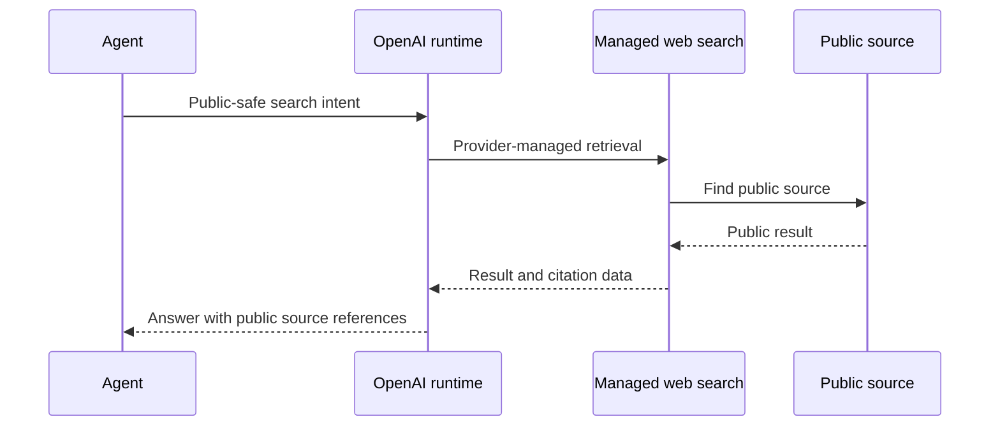

## Research Question

When is OpenAI-managed web search enough for a coding agent, and when should a project use an explicit external search route instead?

## Matrix Row Or Gap

README row: [OpenAI Web Search](https://developers.openai.com/api/docs/guides/tools-web-search)

Current gap:

- `Best Practice`: `Seeking`
- `Research Report`: broad strategy comparison only, no OpenAI-specific research note

## Required Official Sources

- [OpenAI Web Search tool](https://developers.openai.com/api/docs/guides/tools-web-search)
- [OpenAI Codex cloud docs](https://developers.openai.com/codex/cloud)

Record `observedAt` for product availability, runtime behavior, network access, citation behavior, and any volatile limitations.

## Method

- Review official OpenAI docs and separate API web search behavior from Codex product behavior.
- Build a public-safe query set for docs, release notes, standards, and package behavior.
- Compare native/provider-managed search with explicit external routes such as MCP search tools, hosted APIs, and self-hosted SearXNG.
- Record unknowns instead of inferring product behavior that is not documented.

Do not include private account output, local command transcripts, account identifiers, private queries, or project paths.

## Visual Evidence

Expected public-safe visual:

Also include a decision table:

| Route | Use When | Avoid When |
| --- | --- | --- |
| Native OpenAI web search | Low setup and provider-managed retrieval are acceptable. | Operator needs backend control, reproducible routing, or explicit tool lifecycle. |
| Explicit external route | Search backend, logging, credentials, or routing must be governed by the operator. | The product-native route already satisfies the trust and citation needs. |

## Findings To Produce

Separate:

- official claims
- observed behavior
- inference from docs
- unknowns

Cover:

- availability by runtime or product surface
- query visibility and privacy boundary
- citation/source URL quality
- configurability and disable/fallback behavior
- agent support matrix impact

## Matrix Impact

Expected README update:

- keep `Best Practice` as `Seeking` unless an official durable best-practice page exists
- replace the generic strategy report with the OpenAI-specific research report
- update strengths and limitations with evidence-backed wording

## Acceptance Criteria

- Official docs are cited with `observedAt`.
- API and Codex behavior are not conflated.
- Privacy and network-control boundaries are explicit.
- README matrix update is included.
- New durable docs are added to `registry/resources.json`.

## Privacy Notes

Use only public-safe queries. Do not publish private prompts, private source text, private paths, account state, workspace identifiers, or screenshots with account-specific UI.
