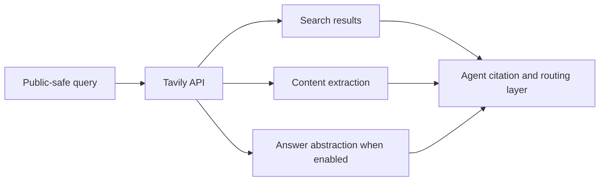

## Research Question

Where does Tavily fit as an agent-oriented hosted retrieval API compared with general web search APIs and self-hosted search?

## Matrix Row Or Gap

README row: [Tavily API](https://docs.tavily.com/api-reference/introduction)

Current gap:

- `Best Practice`: `Seeking`
- `Research Report`: `Researching`

## Required Official Sources

- [Tavily API introduction](https://docs.tavily.com/api-reference/introduction)
- [Tavily Search endpoint](https://docs.tavily.com/documentation/api-reference/endpoint/search)

Record `observedAt` for endpoint behavior, parameters, pricing/quota, data policy, and product scope.

## Method

- Review official Tavily docs.
- Document supported retrieval surfaces only where official docs support them.
- Evaluate search, extraction, answer abstraction, include/exclude domains, and content controls.
- Compare Tavily with Brave Search API and SearXNG.
- Define a public-safe query set for docs, release notes, issues, standards, and current package behavior.

Do not publish tokens, dashboard data, account-specific quota, private queries, or private endpoint details.

## Visual Evidence

Expected flow diagram:

Expected comparison table:

| Capability | Raw Source Access | Synthesized Answer | Agent Risk |
| --- | --- | --- | --- |
| Search result URLs | TBD | TBD | Citation transparency |
| Extracted content | TBD | TBD | Prompt-injection and source context |
| Answer abstraction | TBD | TBD | Reduced transparency if sources are unclear |

## Findings To Produce

Cover:

- official claims
- observed public-query behavior
- citation transparency
- answer abstraction tradeoffs
- data policy, quota, and hosted dependency risks
- wrapper or MCP integration implications

## Matrix Impact

Expected README update:

- replace `Researching` with a Tavily-specific report link
- replace `Seeking` only when a durable best-practice entry exists
- update limitations around hosted dependency, data policy, quota, and abstraction

## Acceptance Criteria

- Official docs are cited with `observedAt`.
- Answer abstraction and citation quality are evaluated separately.
- No account-specific quota, token, or dashboard data is published.
- README matrix update is included.
- New durable docs are added to `registry/resources.json`.

## Privacy Notes

Use only public-safe query examples. Do not publish API keys, private prompts, private URLs, account identifiers, or raw provider dashboard data.
