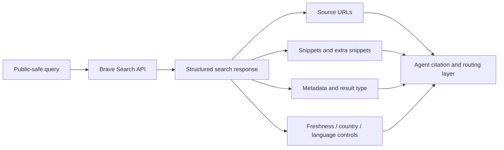

# Brave Search API 调研

[English canonical source](../research/brave-search-api.md) | [中文文档索引](README.md)

## 问题

Brave Search API 是否适合作为 coding agents 的 hosted search backend？它在 trust、quota、cost 和 result shape 上有什么取舍？

## 方法

观察日期：2026-05-23。

本文审查 Brave Search API 官方产品页、API 文档、公开示例和 Brave Search API Data Processing Addendum。本版不包含 authenticated live API samples，因为测试需要 subscription token。因此本文明确区分 documented behavior 和未测试的 runtime behavior。

后续 live testing 可使用的公开安全 query set：

- `SearXNG Search API official documentation`
- `Python 3.14 release notes`
- `OpenTelemetry semantic conventions`
- `Model Context Protocol specification`
- `site:github.com brave search api mcp`

覆盖的 agent ecosystems：

- Codex
- Claude Code
- OpenClaw
- generic MCP-capable agents

未测试：

- authenticated API latency
- public query set 的 live relevance
- account-specific quota behavior
- billing dashboard behavior
- third-party MCP adapters
- region-specific availability

## 输入

仅使用公开文档和公开安全 query examples。不包含 API keys、account identifiers、dashboard screenshots、private prompts、private endpoints、private source excerpts、cookies、tokens 或 customer data。

## 官方来源

- [Brave Search API product page](https://brave.com/search/api/) observed at 2026-05-23.
- [Brave Web Search API documentation](https://api-dashboard.search.brave.com/app/documentation/web-search) observed at 2026-05-23.
- [Brave Search API Data Processing Addendum](https://cdn.search.brave.com/search-api/web/v1/client/_app/immutable/assets/brave-search-api-dpa-latest.DRXCoye6.pdf) dated 2025-09-09, observed at 2026-05-23.
- [Brave Search API Zero Data Retention announcement](https://brave.com/blog/search-api-zero-data-retention/) published 2026-01-26, observed at 2026-05-23.

## 发现

### 官方说明

Brave 将 Search API 定位为基于 Brave independent Web index 的 hosted search API。产品页将它用于 agentic search、RAG、AI search、AI training 和 search-enabled tools。产品页还说明它可以返回 URLs、text、news、images 和 additional LLM context 等 search results。

截至 2026-05-23，公开产品页列出：

- Search：`$5 per 1,000 requests`，每月包含 `$5` free credits，容量 `50 queries per second`
- Answers：`$4 per 1,000 requests`，另加 `$5 per million input/output tokens`，每月包含 `$5` free credits，容量 `2 queries per second`
- Enterprise：custom terms、capacity、endpoints、custom agreements、support 和 full-funnel Zero Data Retention

这些是易变商业条款。任何依赖 cost 或 quota 的建议都应重新核验。

### 已记录的 API 形态

Web Search endpoint 使用：

- base route: `https://api.search.brave.com/res/v1/web/search`
- authentication header: `X-Subscription-Token`
- JSON responses
- query parameter `q`
- `count`、`offset`、`country`、`search_lang`、`ui_lang`、`safesearch`、`freshness` 等 result controls

官方文档还记录了：

- freshness filters：last 24 hours、last 7 days、last 31 days、last year 和 custom date ranges
- country 和 language targeting
- `extra_snippets=true` 时每条结果最多可提供五个 extra snippets
- 用于 custom reranking 和 filtering 的 Goggles
- 放在 `q` 参数里的 search operators，例如 exact phrases、exclusions、site-specific queries 和 file type queries
- 使用 `more_results_available` 的 pagination 检查
- 使用临时 location IDs 的 local enrichments
- 面向 weather、stocks、currency、crypto、sports 和 definitions 等 verticals 的 rich data enrichments

产品页和示例还展示了 images、videos、news、suggestions、spellcheck 和 Answers 等非 web endpoints 或 surfaces。它们对产品可能有价值，但 coding agents 通常应从 Web Search 开始，除非任务明确需要特定 vertical。

### Privacy 和 retention evidence

Brave 将 Search API 宣传为 privacy-oriented，并为 enterprise usage 宣传 Zero Data Retention。2026-05-23 观察到的 Search API Data Processing Addendum 列出 AWS 作为 infrastructure provider，并说明 search query logs 为 `90 days`，同时列出 Enterprise clients 可选择 Zero Data Retention，且受 legal obligations 约束。

对 agent builders 来说，实际结论是：

- Brave 是 hosted provider，因此 queries 会离开用户机器或组织。
- Operators 应在发送敏感 task context 前审查当前 DPA、privacy/security documentation 和 plan terms。
- 除非当前 contract 或官方 plan terms 明确授予，否则不应假设每个 plan 都有 Zero Data Retention。

### Copyright 和 storage constraints

Brave 说明 Search API 返回 publicly available webpages 的 ranked list，以及 snippets 等用于解释相关性的补充信息。它也说明 API 不授予第三方网页内容的权利。存储 API results 需要显式授予 storage rights 的 plan。

对 coding agents 来说，这意味着 Brave 可用于 source discovery 和 snippets，但 agents 应引用打开过的公开 URL，不应把返回 snippets 视为可复用授权内容。

### 基于证据的推断

Brave Search API 适合：

- 团队需要 managed Web search backend
- 需要 structured source URLs 和 snippets
- freshness filters、language/country targeting、site operators 和 reranking controls 很重要
- credential 和 billing management 可接受
- 团队倾向 hosted independent-index provider，而不是运维 SearXNG

不适合：

- 不允许外部 hosted provider 接收 queries
- subscription tokens 无法安全管理
- cost、quota 或 plan terms 不可接受
- workflow 需要完全 operator-owned engine policy 和 logs
- storage rights 或 downstream content reuse 不清晰
- target task set 尚未 benchmark live relevance 和 citation quality

### Unknowns

- coding-agent query sets 上的 live relevance
- real workloads 下的 latency distribution
- 所有 specialized endpoints 对 agent tasks 的具体行为
- 当前 MCP adapter maturity
- published docs 之外的 plan-specific retention 和 storage-right details

## 限制

本文基于文档调研，不声明 live API result quality。后续 benchmark 应在私有环境中使用真实 subscription token，只记录公开安全的 aggregate observations，并避免发布 credentials、account data、raw private logs 或 dashboard screenshots。

## 视觉证据

### Result-shape model

### Scorecard

| Dimension | Observation | Evidence |
| --- | --- | --- |
| Source URL quality | Strong documented fit | Web Search examples include URLs、descriptions、metadata 和 query-dependent snippets。 |
| Freshness controls | Strong documented fit | 官方文档包含 freshness filters 和 recent-result controls。 |
| Quota/cost | Clear but volatile | 产品页截至 2026-05-23 列出 request pricing、monthly credits 和 qps limits。 |
| Privacy boundary | Hosted provider tradeoff | DPA 描述 processing、subprocessors、query-log retention 和 Enterprise ZDR option。 |
| Adapter readiness | Promising but unverified | API shape 适合 wrappers；third-party MCP adapters 仍需单独 review。 |
| Operator control | Weaker than self-hosted | Backend ranking、logs、retention 和 crawler policy 由 provider 管理。 |

### Route decision table

| Use Case | Fit | Reason |
| --- | --- | --- |
| Hosted web search backend | Good | Structured results、source URLs、snippets、freshness controls 和官方 API docs。 |
| Coding-agent documentation lookup | Good candidate | 支持 site operators、freshness filters 和 source URLs；仍需 live benchmark。 |
| Private-context search | Poor by default | Queries 会发送到 hosted provider；应先改写为 public-safe queries。 |
| 无运维能力团队的 primary agent search | Good candidate | 避免运维 SearXNG，但引入 credential、cost 和 provider-policy 要求。 |
| Fully operator-controlled search | Weak | 当 logs 和 backend policy 必须自有时，SearXNG 或 internal search 更合适。 |

## Matrix Impact

README option matrix update：

- Solution row: `Brave Search API`
- Best Practice cell: 保持 `寻找中`
- Research Report cell: 链接本文
- Strengths: 强调 hosted independent-index Web search、structured source URLs、freshness controls、country/language targeting、extra snippets 和 Goggles
- Limitations: 强调 subscription token management、cost/quota volatility、hosted-provider privacy boundary、storage/copyright constraints 和 missing live benchmark
- Agent Support Matrix: 当通过 tool calls 或 adapters 包装时，保留 Codex、Claude Code、OpenClaw 和 generic MCP-capable agents

## 建议

当团队希望获得 structured public Web results、又不想运维自己的搜索后端时，Brave Search API 是值得认真评估的 hosted search candidate。它尤其适合需要 fresh public documentation、release notes、source URLs、snippets 和 query controls 的任务。

不要把它作为 private task context 的盲目默认路线。Agent queries 应保持 public-safe，subscription token 应放在 prompts 和 repository files 之外，并在采用为主路线前 benchmark relevance、citation quality、latency、cost 和 retention terms。

## 隐私说明

Agents 不应在 Brave queries 中包含 private source code、private issue text、customer data、private hostnames、本机路径、cookies、tokens 或 credentials。API key 应存在 secret store 或本地环境中，不应出现在 examples、prompts、registry entries、screenshots 或 committed config 中。

如果任务包含 private context，应先改写成窄范围 public query，再调用 Brave-backed route。如果 query 无法做到 public-safe，应使用 local repository search、private documentation search 或请求用户确认。
