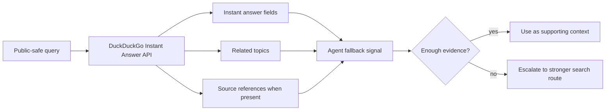

# DuckDuckGo Instant Answer API 调研

[English canonical source](../research/duckduckgo-instant-answer-api.md) | [中文文档索引](README.md)

## 问题

DuckDuckGo Instant Answer API 能否作为 agent 的轻量 fallback signal？为什么它不适合作为完整主搜索后端？

## 方法

观察日期：2026-05-23。

本文审查公开文档和 primary implementation notes。本版不包含 live endpoint samples，因此行为判断只基于已记录的能力和限制。

后续 live testing 可使用的公开安全 query set：

- `SearXNG`
- `Python programming language`
- `Model Context Protocol`
- `DuckDuckGo Instant Answer API`
- `OpenTelemetry`

覆盖的 agent ecosystems：

- Codex
- Claude Code
- OpenClaw
- generic MCP-capable agents

未测试：

- 私有账号行为
- 未记录的 rate limits
- load 下的 latency、availability 或 result quality
- 地区可用性
- production wrapper 行为

## 输入

仅使用公开来源和公开安全 query examples。不包含 private prompts、private source excerpts、本机路径、账号数据、endpoint secrets、cookies、tokens 或私有截图。

## 官方和 Primary Sources

- [DuckDuckGo Instant Answers help page](https://duckduckgo.com/duckduckgo-help-pages/features/instant-answers-and-other-features/) observed at 2026-05-23.
- [DuckDuckGo API entry point](https://duckduckgo.com/api) observed at 2026-05-23.
- [DuckDuckGo API endpoint](https://api.duckduckgo.com/api) observed at 2026-05-23.
- [SearXNG DuckDuckGo engine documentation](https://docs.searxng.org/dev/engines/online/duckduckgo.html) observed at 2026-05-23.
- [SearXNG `duckduckgo_definitions` source documentation](https://docs.searxng.org/_modules/searx/engines/duckduckgo_definitions.html) observed at 2026-05-23.

## 发现

### 官方说明

DuckDuckGo 将 Instant Answers 描述为直接回答能力，适用于 calculations、factual information、flight status、password generation 和其他 quick-answer tasks。这说明 Instant Answers 是选择性的 answer layer，而不是通用 web-search results API。

公开 API 入口仍然存在，但 API documentation surface 有限。DuckDuckGo API entry point 是官方 URL，而 SearXNG 的 DuckDuckGo engine documentation 说明 DuckDuckGo Instant Answer API 已不再有正式文档，当前行为依赖实现侧推断。对 agent builders 来说，这意味着维护和稳定性风险。

### Primary implementation notes 中可观察到的内容

SearXNG 记录了一个使用 JSON output 的 DuckDuckGo Instant Answer route，并标记该实现不需要 API key。它也说明 language support 不清晰，看起来主要基于 English terms。

SearXNG 还记录了 malformed 或 broken answer text 可能出现，某些结果应被忽略。对 agents 来说，fallback signal 在影响回答前必须先被验证。

### 基于证据的推断

DuckDuckGo Instant Answer API 可作为窄范围 fallback，用于：

- entity lookup
- definition-style answers
- calculator 或 utility-style answers
- 轻量公开事实
- 升级到更强 search backend 前的 routing hints

它不应被视为 coding-agent 主搜索后端，因为：

- 它没有被记录为完整 web search results API
- broad result ranking 和 deep source coverage 不是它的核心形态
- 官方 API 文档可见性弱
- language 和 localization 行为不清晰
- freshness、quota 和 stability guarantees 不足以支撑 primary routing

### Unknowns

- 当前 rate-limit policy
- agent traffic 下的 production availability
- JSON schema stability
- documented language support
- 技术文档和 release notes 的 freshness expectations

## 限制

本文不声明 live endpoint performance 或 result quality。后续 benchmark 应使用上面的公开安全 query set，并记录：

- response status
- returned top-level fields
- 是否存在 source URL
- answer 是否对 coding-agent task 有帮助
- latency
- repeated-query stability

## 视觉证据

### Result-shape model

### Route decision table

| Use Case | Fit | Reason |
| --- | --- | --- |
| Entity or definition lookup | Good fallback | 当存在 source evidence 时，Instant-answer style responses 可能足够。 |
| Calculator or utility answer | Good fallback | DuckDuckGo 记录了 utility-style Instant Answers。 |
| Coding documentation search | Weak | Agents 通常需要 ranked source URLs、current docs、examples 和 release notes。 |
| Primary web-search backend | Poor | 该 API 没有被记录为完整 web search results API。 |
| Hybrid search routing signal | Useful with guards | 可帮助判断是否需要更强 route，但不应作为唯一证据。 |

## Matrix Impact

README option matrix update：

- Solution row: `DuckDuckGo Instant Answer API`
- Best Practice cell: 保持 `寻找中`
- Research Report cell: 链接本文
- Strengths: 强调 no-key instant-answer JSON 和轻量 fallback 用途
- Limitations: 强调 non-full-search scope、弱文档可见性、不清晰的 language/freshness/coverage 行为
- Agent Support Matrix: 保持 generic wrapper-capable agent support

## 建议

DuckDuckGo Instant Answer API 只适合作为轻量 fallback 或 routing signal。当 agent 需要快速公开事实、定义或 utility answer，并且能验证返回的 source context 时，它是合适的。

不要把它作为 coding-agent tasks 的默认主搜索后端。当任务需要 broad source discovery、ranked URLs、fresh documentation、release notes、issue threads 或 citation-quality evidence 时，应优先考虑 SearXNG、hosted search APIs、native provider search 或 browser retrieval。

## 隐私说明

Agents 只应发送窄范围、公开安全的 query。不要包含 private source code、本机路径、private issue text、private hostnames、customer data、account identifiers、cookies、tokens 或 credentials。

由于这条路线更适合作为 fallback，agents 应避免发送 raw task context。应将需求改写为短的公开 query，例如 entity name、package name、public API name 或 standards term。
